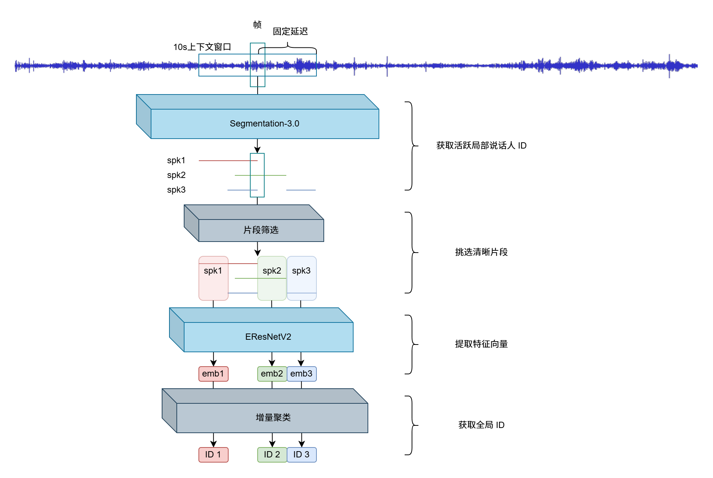

# RealtimeSD

基于 [`pyannote/segmentation-3.0`](https://huggingface.co/pyannote/segmentation-3.0) 和 [`3D-Speaker/ERes2NetV2`](https://github.com/modelscope/3D-Speaker) 的实时说话人分离流水线，重点面向重叠音频处理场景，是以下流程的简单工程实现。



## 主要内容

- 在线 speaker diarization 流水线入口：`pipline.py`
- 配置：`config.yaml`
- 运行脚本：`run.sh`、`test_der.sh`
- 流水线实现说明：`pipline/README.md`

## 环境要求

- Python `>= 3.13`
- 建议使用 Linux + CUDA 环境进行推理
- 首次运行可能需要访问 Hugging Face 和 ModelScope 下载模型

## 安装

使用 `uv`：

```bash
uv sync
```

使用 `pip`：

```bash
python3 -m venv .venv
source .venv/bin/activate
pip install -r requirements.txt
```

## 模型依赖

运行时通常需要两个模型：

- speaker encoder：`ERes2NetV2`
- segmentation：`pyannote/segmentation-3.0`

默认行为：

- 如果 `--model_path` 未提供，会尝试从 ModelScope 下载默认 `ERes2NetV2`
- segmentation 模型会从 Hugging Face 下载并缓存到 `./pretrained/huggingface`

Hugging Face 模型需要授权，可通过环境变量或参数提供 token：

```bash
export HF_TOKEN=your_token
```

## 快速开始

单文件推理：

```bash
python3 pipline.py \
  --wav ./examples/example.wav \
  --output_dir ./exp/demo \
  --config ./online_pipline_overlap_config.yaml
```

批量推理：

```bash
python3 pipline.py \
  --wav ./examples \
  --output_dir ./exp/batch_demo \
  --config ./online_pipline_overlap_config.yaml
```

常用覆盖项：

```bash
python3 pipline.py \
  --wav ./examples \
  --output_dir ./exp/batch_demo \
  --config ./online_pipline_overlap_config.yaml \
  --model_path ./pretrained/custom_eres2netv2_finetune/final_model.ckpt \
  --hf_cache_dir ./pretrained/huggingface \
  --device cuda:0 \
  --verbose
```

如果需要窗口级结构化调试信息，记得再加 `--debug`。

## 输出文件

每个音频通常会在输出目录下生成：

- `*.streaming.rttm`：流式分离结果
- `run.log`：运行日志（使用脚本时）
- `command.log`：实际命令（使用脚本时）

如果开启 `--save_segmentation_scores`，还会生成：

- `*.segmentation_scores.jsonl`

## 使用脚本

推荐先用仓库自带脚本复现实验。

直接运行：

```bash
bash run.sh ./examples
```

带 DER 评估的运行：

```bash
REF_RTTM=./datasets/rttm \
RUN_NAME=baseline \
bash test_der.sh ./examples
```

常用环境变量：

- `CONFIG_PATH`
- `MODEL_PATH`
- `HF_TOKEN`
- `HF_CACHE_DIR`
- `OUTPUT_ROOT`
- `RUN_NAME`
- `DEBUG`
- `SAVE_SEGMENTATION_SCORES`
- `REF_RTTM`
- `DER_VERBOSE`

## DER 评估

`compute_der.py` 支持单文件和批量模式，`--ref` / `--sys` 都可以直接传文件或目录。

单文件：

```bash
python3 compute_der.py \
  --ref ./datasets/rttm/L_R003S01C02.rttm \
  --sys ./exp/demo/L_R003S01C02.streaming.rttm \
  --collar 0.0 \
  --ignore-overlap
```

批量：

```bash
python3 compute_der.py \
  --ref ./datasets/rttm \
  --sys ./exp/demo \
  --sys-suffix .streaming.rttm \
  --ref-suffix .rttm \
  --collar 0.0 \
  --ignore-overlap \
  --verbose
```

## 配置说明

默认配置文件是 `config.yaml`，里面主要包含：

- 运行设备和模型路径
- 左右上下文长度与在线步长
- segmentation 激活阈值
- embedding 提取片段长度
- speaker 匹配、合并与 streaming 输出参数

当前 YAML 中一些和 overlap 更相关的默认值包括：

- `tau_active=0.50`
- `target_primary_min_duration=0.15`
- `target_overlap_min_duration=0.08`
- `min_segment_duration_for_embedding=0.30`
- `global_match_threshold=0.55`
- `merge_threshold=0.70`
- `max_frame_speakers=3`
- `streaming_flush_interval=20.0`

建议优先调整这些参数：

- `tau_active`
- `target_primary_min_duration`
- `target_overlap_min_duration`
- `min_segment_duration_for_embedding`
- `delta_new`
- `global_match_threshold`
- `merge_threshold`
- `max_frame_speakers`
- `streaming_flush_interval`

## 仓库结构

- `pipline/`：在线分离主实现
- `speakerlab/`：本地依赖的 speaker encoder 相关模块与 `md-eval.pl`
- `compute_der.py`：DER 统计与批量评估
- `run.sh`：基础运行脚本
- `test_der.sh`：运行并自动评估 DER 的脚本
- `pipline/README.md`：按代码结构整理的实现与调参说明

## 备注

- 仓库当前偏实验性质，默认配置更适合中文、16kHz、流式 speaker diarization 场景
- `examples/`、`datasets/`、`pretrained/` 中的内容依赖你的本地数据和模型准备情况
- 更细的实现说明见 `pipline/README.md`
